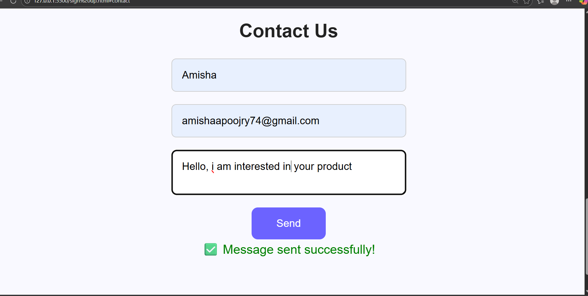

# SaaS-style-Landing-Sign-Up-Workflow

The SaaS-Style Landing Page + Sign-Up Workflow project is a full-stack web application that demonstrates the fundamental flow of a Software-as-a-Service (SaaS) platform. It combines a modern landing page design with a functional user sign-up and email verification system.

This project aims to showcase how startups or SaaS companies manage the initial user onboarding process — from visiting the product landing page to successfully creating an account and receiving an automated confirmation email.

📂 Project Folder Structure

launchpad-saas

├── index.html          
├── style.css        
├── script.js          
    ├── server.js       
    ├── models/User.js  
    ├── .env            
    └── package.json    

    ## 📸 Project Preview

### 🏠 Home Page

### 🚀 LaunchPad Section

### ⚙️ Key Features

### 📝 Sign Up Page

### 💬 Contact Us Page

    
